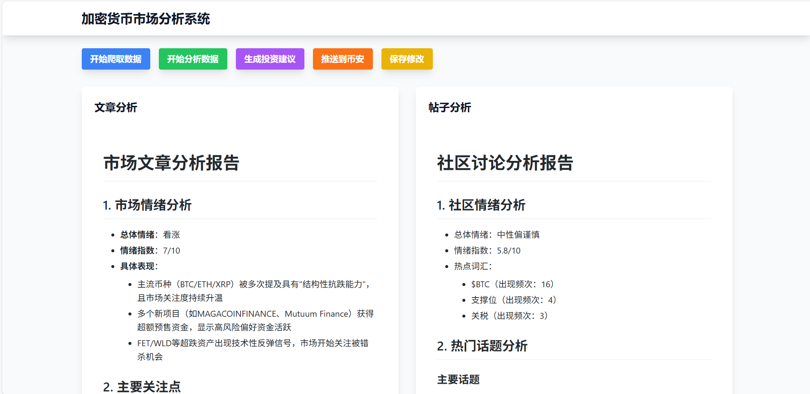

# 加密货币市场分析机器人

这是一个基于AI的加密货币市场分析系统，可以自动收集市场数据、进行分析并在币安社区发布分析报告。系统使用OpenAI API进行市场分析，使用Playwright进行数据采集和内容发布。同时提供Web界面进行实时监控和管理。

## 项目架构

```
llm-binance/
├── data/                # 数据存储目录
│   ├── cmc_articles.json       # 文章数据
│   ├── cmc_btc_analysis.json  # BTC分析帖子数据
│   ├── article_analysis.json  # 文章分析结果
│   ├── post_analysis.json     # 帖子分析结果
│   ├── btc_price_data.json   # BTC价格数据（暂不支持）
│   └── investment_recommendation.json # 投资建议
├── src/                 # 源代码目录
│   ├── services/       # 核心服务组件
│   │   ├── analyzer.py  # 市场分析器
│   │   ├── crawler.py   # 数据爬虫
│   │   └── publisher.py # 内容发布器
│   └── web/            # Web应用组件
│       ├── static/     # 静态资源
│       └── templates/  # 页面模板
├── app.py              # Web应用入口
├── main.py             # 主程序入口
├── requirements.txt    # 项目依赖
├── .env               # 环境配置文件
└── README.md          # 项目文档
```

## 核心组件

### 1. 数据爬虫 (crawler.py)

- 负责从各个数据源收集市场信息
- 主要功能：
  * 爬取币安社区BTC分析帖子 (`crawl_market_news()`)
  * 爬取CoinMarketCap文章 (`crawl_articles()`)
  * 获取BTC实时价格数据 (`crawl_price_data()`)
- 使用Playwright进行浏览器自动化
- 支持自动重试和错误处理
- 数据以JSON格式保存

### 2. 市场分析器 (analyzer.py)

- 使用OpenAI API分析市场数据
- 主要功能：
  * 分析文章内容 (`analyze_articles()`)
  * 分析社区讨论 (`analyze_posts()`)
  * 生成投资建议 (`generate_investment_recommendation()`)
- 分析内容包括：
  * 市场情绪分析
  * 热点话题识别
  * 价格趋势预测
  * 投资建议生成

### 3. 内容发布器 (publisher.py)

- 负责将分析结果发布到币安社区
- 主要功能：
  * 使用Chrome用户配置文件登录 (`push_to_binance()`)
  * 自动发布分析报告 (`push_recommendation()`)
  * 错误处理和截图保存
- 使用Playwright管理浏览器会话

### 4. 主控制器 (main.py)

- 协调各个组件的工作流程
- 实现功能：
  * 定时任务调度
  * 组件生命周期管理
  * 错误处理和重试机制
  * 运行状态监控

### 5. Web应用 (app.py)

- 提供Web界面进行系统管理和监控
- 主要功能：
  * 实时任务状态监控
  * 分析结果可视化展示
  * 手动触发分析任务
  * 系统配置管理
- 技术栈：
  * Flask Web框架
  * WebSocket实时通信
  * Bootstrap UI框架
  * Chart.js数据可视化

### Web界面功能

1. **数据监控**：

   - 实时显示数据采集状态
   - 展示最新的分析结果
   - 可视化市场趋势图表
2. **任务管理**：

   - 手动触发数据采集
   - 手动触发市场分析
   - 查看任务执行历史
3. **系统配置**：

   - OpenAI API配置
   - 爬虫参数设置
   - 发布规则管理
4. **日志查看**：

   - 实时日志流
   - 错误日志查询
   - 操作记录追踪

## 配置说明

### 环境变量 (.env)

```ini
# 数据存储路径配置
DATA_SAVE_PATH=./data

# OpenAI API配置
OPENAI_API_KEY=your_api_key_here
OPENAI_API_BASE=https://api.openai.com/v1

# 模型配置
MODEL=deepseek-ai/DeepSeek-V3
PREDICTION_THRESHOLD=0.75  # 预测阈值

# 爬虫配置
CRAWLER_INTERVAL=3600  # 爬取间隔（秒）

# Web应用配置
FLASK_ENV=development
FLASK_DEBUG=True
FLASK_PORT=5000
FLASK_HOST=0.0.0.0

# WebSocket配置
WS_PORT=5001
```

### 依赖安装

```bash
# 安装Python依赖
pip install -r requirements.txt

# 安装Playwright浏览器
playwright install chromium
```

## 使用方法

1. **环境准备**：

```bash
# 克隆项目
git clone [项目地址]
cd llm-binance


```

2. **安装依赖**：

```bash
pip install -r requirements.txt
playwright install chromium
```

3. **配置环境**：

```bash
cp .env.example .env
# 编辑.env文件，填写必要的配置信息
```

4. **运行程序（一次执行全部）**：

```bash
python main.py
```

5. **启动Web应用（可不启动，可按功能调用）**：

```bash
# 启动Web服务
python app.py

# 访问Web界面
打开浏览器访问: http://localhost:5000
```



## 数据文件说明

1. **输入数据**：

- `cmc_articles.json`: CoinMarketCap文章数据
- `cmc_btc_analysis.json`: 币安社区BTC分析帖子
- `btc_price_data.json`: BTC价格数据 (暂不支持)

2. **分析结果**：

- `article_analysis.json`: 文章分析结果
- `post_analysis.json`: 帖子分析结果
- `investment_recommendation.json`: 生成的投资建议

## 错误处理

- **数据采集错误**：

  * 自动重试机制（最多3次）
  * 保存错误截图
  * 详细错误日志
- **分析错误**：

  * API调用失败处理
  * 数据格式验证
  * 结果完整性检查
- **发布错误**：

  * 浏览器会话管理
  * 页面加载超时处理
  * 操作失败重试

## 注意事项

1. **API使用**：

   - OpenAI API调用频率限制
   - 币安社区发文规则遵守
   - API密钥安全保护
2. **系统要求**：

   - Python 3.8+
   - Chrome浏览器（最新版本）
   - 8GB+ 内存
   - 稳定的网络连接
3. **数据安全**：

   - 定期备份data目录
   - 不要提交或分享.env文件
   - 保护好用户凭证

## 开发计划

- [ ] 添加更多数据源：

  * TradingView技术指标
  * Twitter情绪分析
  * 链上数据分析
- [ ] 优化分析模型：

  * 自定义模型训练
  * 多模型集成分析
  * 准确度评估系统
- [ ] 功能增强：

  * Web管理界面
  * 实时监控告警
  * 多币种分析支持

## 贡献指南

1. **代码规范**：

   - 遵循PEP 8
   - 类型注解
   - 完整的文档字符串
2. **提交规范**：

   - 清晰的提交信息
   - 单一功能改动
   - 包含测试用例
3. **文档更新**：

   - 更新README
   - 添加注释
   - 更新配置示例

## 许可证

MIT License
